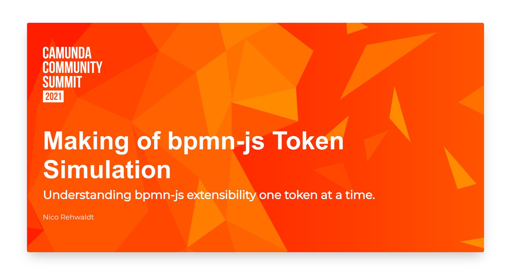

# Making of Token Simulation

Slides of my bpmn.io talk at the [Camunda Community Summit 2021](https://summit.camunda.com).

---

Slide deck built with [`pfwr`](https://github.com/nikku/pfwr) - Turns your markdown files into a beautiful slide deck.
