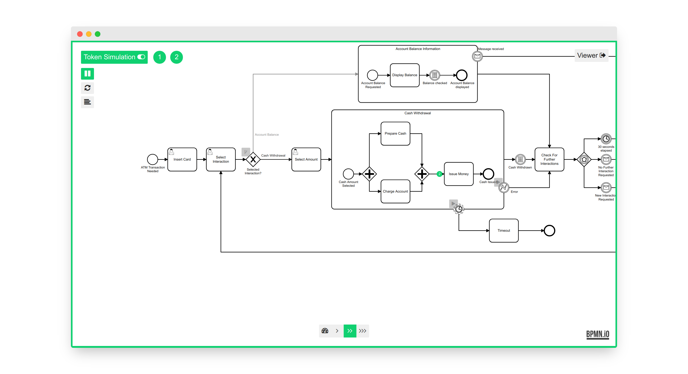
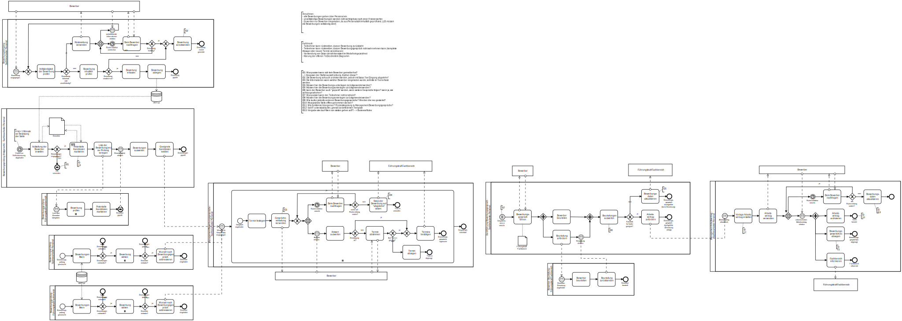
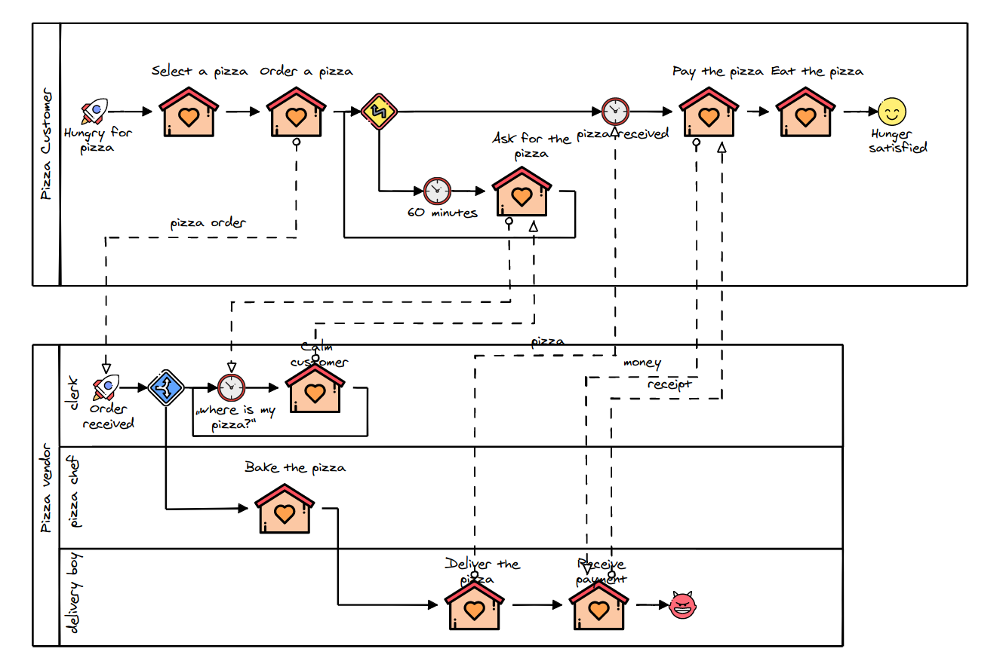
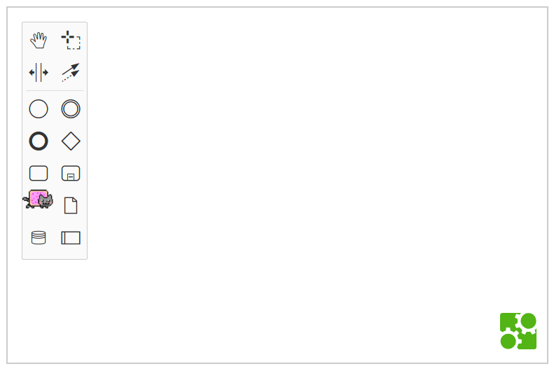
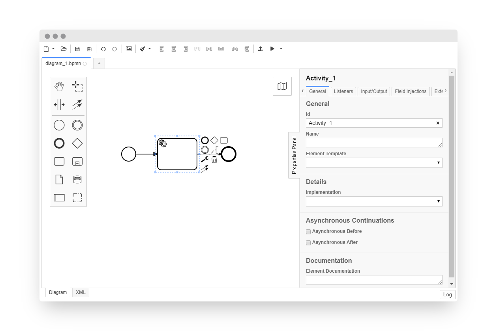

<!--config
theme=cccon
-->

<style>
  .slide:not([data-theme]):before {
    content: '';
    position: absolute;
    left: 0;
    top: 0;
    right: 0;
    background: #ff3000;
    height: .2em;
  }

  .slide[data-theme='cccon'] {
    --font-family-body: Arial;
    --font-family-heading: Arial;
    --slide-margin: 4rem;
    --block-margin: calc(var(--slide-margin) * .25);
    background: url('./community-summit-bg.png');
    color: white;
  }

  .slide[data-theme='cccon'] h5,
  .slide[data-theme='cccon'] p {
    margin-top: var(--block-margin);
  }

  .slide[data-theme='eco'] {
    --color-highlight-bg: #ff3000;
  }
</style>


## Making of bpmn-js Token Simulation

##### Understanding bpmn-js extensibility one token at a time.

<small style="font-size: .5em">Nico Rehwaldt</small>


---

## About Me

* Software developer at Camunda
* bpmn.io creator and project lead
* [`@nikku`](https://github.com/nikku) on GitHub

---

## Agenda

:one: Token simulation?

:two: About bpmn-js

:three: bpmn-js extensibility

:four: How does token simulation plug in?

---

## :one: Token Simulation?

---

<!--config
align=right
theme=eco
-->

### A _picture_ is worth _a thousand words_.

---

<!--config
align=right
theme=eco
-->

### A _moving token_ is worth _a whole bunch of static BPMN diagrams_.

---

[](https://github.com/bpmn-io/bpmn-js-token-simulation)

---

## Core Idea: Token Flow = :bulb:

* Understand wait, join, and split semantics
* Learn BPMN execution in a playful manner
* Aid your understanding of a diagrams semantics

---

## What it is not

* Batch processing simulator
* Business intelligence tool
* Verifier / dead lock / live lock analyzer

---

## :two: About bpmn-js

---

## bpmn-js

* A BPMN diagram renderer and editing toolkit
* Embeds into any web page
* Extensible by design

<small style="margin-top: 2em; display: block">:arrow_right: [`https://github.com/bpmn-io/bpmn-js`](https://github.com/bpmn-io/bpmn-js)</small>

---



---

[](https://bpmn.io/blog/posts/2020-modeling-kids-at-home-edition.html)

---

[](https://github.com/bpmn-io/bpmn-js-nyan)

---

[](https://github.com/camunda/camunda-modeler)

---

## :three: bpmn-js Extensibility

---

## A (BPMN) Diagram Toolbox

* Element discovery, rendering and interaction
* Selection, navigation, search
* Palette and context pad
* Modeling primitives and stacked behaviors
* Overlays
* ...

---

## An Extensible Architecture

* Named Services offer behavior
* Modules group services into logical units
* Instantiation and discovery via [dependency injection](https://en.wikipedia.org/wiki/Dependency_injection)

---


## Extension Cases

* :orange_book: Interface with bpmn-js via API
* :blue_book: Build your own extensions
* :green_book: Replace an existing service / functionality

---

## :orange_book: Select an Element

```javascript
const bpmnModeler = new BpmnModeler();

const selection = bpmnModeler.get('selection');
const elementRegistry = bpmnModeler.get('elementRegistry');

selection.select([
  elementRegistry.get('Task_1')
]);
```

---

## :orange_book: Model Programmatically

```javascript
const modeling = bpmnModeler.get('modeling');

modeling.createShape(
  { type: 'bpmn:ServiceTask' },
  { x: 10, y: 20 }
);
```

---

## :blue_book: Implement a Service

```javascript
// TaskSelection.js
export default function TaskSelection(selection, elementRegistry) {

  /**
   * Select this very special task
   */
  this.selectTask1 = function() {
    selection.select([
      elementRegistry.get('Task_1')
    ])
  };
}
```

---

## :blue_book: Create a Module

```javascript
// TaskSelectionModule.js
import TaskSelection from './TaskSelection';

export default {
  taskSelection: [ 'type', TaskSelection ]
};
```

---

## :blue_book: Extend bpmn-js

```javascript
import taskSelectionModule from './TaskSelectionModule';

const bpmnModeler = new BpmnModeler({
  additionalModules: [
    taskSelectionModule
  ]
});

const taskSelection = bpmnModeler.get('taskSelection');

taskSelection.selectTask1();
```

---

## :four: How does token simulation plug in?

---

<!--config
align=center
theme=eco
-->

## Code Review

---

## In a Nutshell

* Visualizations on top of the actual BPMN diagram
* Accounts for _editor_ or _viewer_
* Custom controls to interact with the simulator
* Disabled modeling interaction :skull_and_crossbones:
* A (single instance) process engine

---

<!--config
align=left
-->


## Thank you.

---

<!--config
align=center
-->

# :question:

---

## Resources

* https://github.com/bpmn-io/bpmn-js-token-simulation

* https://forum.bpmn.io